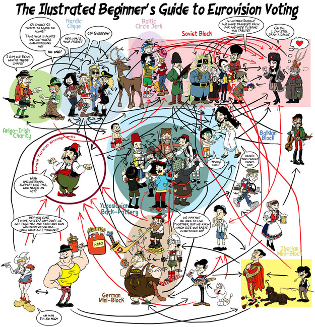

# Eurovision

Data around how to win Eurovision

# Business Problem 
If you are a broadcaster whose country participates in the Eurovision contest, it will be helpful to know factors that contribute to your country winning or not, some under your control, some not.  This analysis looks for those factors in Eurovision final results from 2013 to 2023.

Candidate factors:
* order of performance
* geographical bloc voting
* number of performers on stage
* color of costume
* repeat appearance of performer at Eurovision

# Background
The Eurovision Song Contest has been held annually for more than 60 years.  It is an internationally televised songwriting competition, organised by the European Broadcasting Union and featuring participants chosen by EBU member broadcasters representing their countries from across Europe and beyond.  (https://eurovision.tv/about/how-it-works)

Some interesting facts and figures:  (https://eurovision.tv/about/facts-and-figures)

Here is an article that discusses how appearing later in the final increases the contestant's chance of winning, along with a nice summary of other research about what makes a winner:  https://www.cambridge.org/core/journals/judgment-and-decision-making/article/order-effects-in-the-results-of-song-contests-evidence-from-the-eurovision-and-the-new-wave/C03D0D5AA384362736FE1EB59A75516C

The contest consists of numerous dress rehearsals and culminates in two semi-finals and one final.  Full rules are here:  https://en.wikipedia.org/wiki/Rules_of_the_Eurovision_Song_Contest#:~:text=All%20remaining%20competing%20countries%20are,case%2025%20countries%20would%20compete

For the final, there are 25 or 26 acts - 
* the host country of the contest and the "Big Five" countries automatically qualify (France, Germany, Italy, Spain and the United Kingdom - the group of countries who via their broadcasters make the biggest financial contribution towards the organisation of the Contest.)
* the top ten finishers from each semi-final also compete.  If the host country is in the big 5, that year only has 25 acts in the final.

Eurovision voting makes it a seriously interesting topic for data analysis.  The rules are:  

*In each show, after all songs have been performed, each country will give two sets of points (1, 2, 3, 4, 5, 6, 7, 8, 10 and 12) to their favourite songs; one set is given by a jury of five music industry professionals from that country, and one set given by viewers watching the show in country. Viewers can vote by telephone, SMS and through the official app.*

*Out of fairness, you cannot vote for your own country.*

*In the Semi-Finals, only those countries who took part in that specific show can vote (along with 2 or 3 of the ‘Big Five’ who are already in the Grand Final), whereas in the Grand Final, all competing countries can vote.*

*At the end of the Grand Final, the song that has received the most points wins the iconic trophy, and is performed once more.*

# Data Methods 
Eurovision data is available here:  https://eschome.net/index.html
* Scraping challenge:  you have to interact with the screen to get it to bring up the result screen, and that screen always has the same name.
* Approach 1:  download with cut and paste to excel, then manually massage the excel data to make it analysis friendly.  See the "2023_Finals*" files for what that looks like.

# Results 
- include links to youtube and public data viz

# Conclusion 

# Other questions not considered
Reform voting process?  https://www.electoral-reform.org.uk/time-for-a-key-change-how-we-would-reform-eurovision-voting/

# Links
https://www.linkedin.com/in/eyatzeck/
https://public.tableau.com/app/profile/elena.yatzeck/vizzes
eyatzeck@gmail.com

# To do
* Jupyter Notebook containing your code
  * python
  * excel or sql
  * data cleaning
* CSV data if any
* Pdf of your presentation

